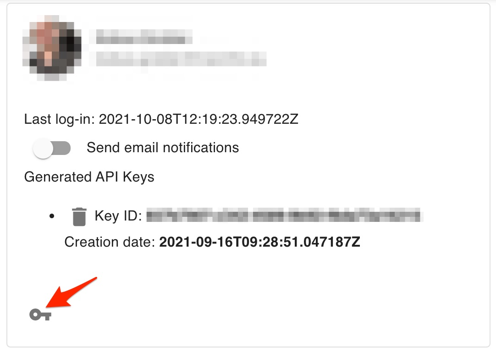

# GuardAI Adversarial Security Assessment Platform for AI API

The GuardAI Platform, created by [NavInfo Europe](https://www.navinfo.eu), is used to measure the 
Adversarial and Natural Robustness of a model.

The provided API is used in automation to integrate testing into your AI
development pipeline. Specifically, this enables integration with continuous integration and/or deployment systems.

## API Guide
In general, using the GuardAI API consists of the following high level steps:
1. Creating API credentials - go to the Profile page:

   

2. Click on the key icon to create a new API key:

   

3. Setting up the API client

   Using the API key created in step 1, create an API client for your chosen language, for example, in Python:
   ```python
    ...
    config = load_sdk_config()
    auth_token = get_auth_token(config['connection']['host'],
                                config['connection']['api-key'], config['connection']['api-key-id'])
    api_client = get_api_client(config['connection']['host'], auth_token)
    ...
   ```
4. Use the api client to make API calls:
   ```python
    ...
    project_api = ProjectApi(api_client)
    print('Listing projects...')
    projects = project_api.get_projects()
    ...
   ```
   See the example code for examples on how to get information on projects, tests and how to start a robustness test. 
   Also consult the GuardAI SDK for guidance on how to integrate new models into the platform.


## API Examples
[Python examples](python/README.md#Running-the-example-code)

## API Reference Documentation
[HTML Documentation](https://navinfoeurope.github.io/guardai-api/docs/index.html)

[Python API client documentation](python/guardai_api/README.md#Documentation-for-API-Endpoints)

### Source code
[GitHub](https://github.com/navinfoeurope/guardai-api/)
